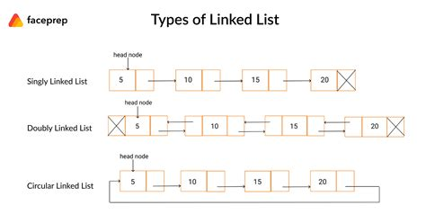

# Linked Lists Tutorial


### Introduction
A linked list is a linear data structure where elements, known as nodes, are linked using pointers. Each node typically contains:

- Data: The value stored in the node.
- Pointer(s): A reference to the next node (and the previous node in doubly-linked lists).

Unlike dynamic arrays, which store data in contiguous memory locations, linked lists store data in random memory locations. Each node contains a pointer that connects it to the next node, ensuring the sequence of elements.

### Types of Linked Lists

- **Singly Linked List**:  
  Each node points to the next node. Used in scenarios like stacks or simple queues.  
  _Example_: Implementing a browser's back functionality with one-directional navigation.

- **Doubly Linked List**:  
  Each node points to both the next and previous nodes, allowing bidirectional traversal.  
  _Example_: A music player's playlist with "Next" and "Previous" buttons.

- **Circular Linked List**:  
  The last node points back to the first node, forming a loop. Useful in applications where the data structure needs to be circular, like buffering.  
  _Example_: Implementing a round-robin scheduler.




### Why Use Linked Lists?
- Dynamic size: No need for memory reallocation or resizing as in arrays.
- Efficient insertions and deletions: Particularly at the beginning or end (O(1) at head or tail).
- Memory management: Linked lists dynamically allocate memory, reducing waste.

### Linked List Structure
- Head: Points to the first node in the list. Access to the head is O(1).
- Tail: Points to the last node in the list (in doubly-linked lists). Access to the tail is O(1).
- Node: Contains the data and pointers.

| **Operation**      | **Dynamic Array** | **Linked List** |
|---------------------|-------------------|-----------------|
| **Insert Front**    | O(n)             | O(1)           |
| **Insert Middle**   | O(n)             | O(n)           |
| **Insert End**      | O(1)             | O(1)           |
| **Remove Front**    | O(n)             | O(1)           |
| **Remove Middle**   | O(n)             | O(n)           |
| **Remove End**      | O(1)             | O(1)           |
| **Access by Index** | O(1)             | O(n)           |

Dynamic arrays excel at indexed access (O(1)), while linked lists excel at frequent insertions and deletions.

### Linked List Operations

| **Operation**   | **Description**                              | **Efficiency** |
|------------------|----------------------------------------------|----------------|
| **InsertHead**   | Adds an element to the beginning of the list. | O(1)           |
| **InsertTail**   | Adds an element to the end of the list.       | O(1)           |
| **Insert**       | Adds an element at a specific position.       | O(n)           |
| **RemoveHead**   | Removes the first element in the list.        | O(1)           |
| **RemoveTail**   | Removes the last element in the list.         | O(1)           |
| **Remove**       | Removes a specific element.                   | O(n)           |
| **Traverse**     | Iterates through all elements.                | O(n)           |

### Code Example: Singly Linked List
Here is a basic implementation of a singly linked list:

```csharp
using System;

class Node {
    public int Data; // The value stored in the node
    public Node Next; // Pointer to the next node

    public Node(int data) {
        Data = data;
        Next = null; // Initialize the next pointer to null
    }
}

class LinkedList {
    private Node head; // Reference to the head of the list

    // Inserts a new node at the beginning of the list
    public void InsertAtHead(int data) {
        Node newNode = new Node(data) { Next = head }; // New node points to current head
        head = newNode; // Update head to the new node
    }

    // Inserts a new node at the end of the list
    public void InsertAtTail(int data) {
        Node newNode = new Node(data);
        if (head == null) {
            head = newNode; // If the list is empty, set the head
            return;
        }
        Node current = head;
        while (current.Next != null) {
            current = current.Next; // Traverse to the last node
        }
        current.Next = newNode; // Add new node at the end
    }

    // Traverses the list and prints all node values
    public void Traverse() {
        Node current = head;
        while (current != null) {
            Console.Write($"{current.Data} -> "); // Print each node's data
            current = current.Next; // Move to the next node
        }
        Console.WriteLine("null"); // Indicate the end of the list
    }
}

class Program {
    static void Main() {
        LinkedList list = new LinkedList();

        list.InsertAtHead(10);
        list.InsertAtHead(20);
        list.Traverse(); // Output: 20 -> 10 -> null

        list.InsertAtTail(30);
        list.InsertAtTail(40);
        list.Traverse(); // Output: 20 -> 10 -> 30 -> 40 -> null
    }
}
```
### Adding to a Linked List

Insert at the Head
- Create a new node.
- Set the new node's Next to the current head.
- Update the head to the new node.

Insert at the Tail
- Create a new node.
- Traverse the list to find the last node.
- Set the last node's Next to the new node.

Insert in the Middle
- Create a new node.
- Update the new node's pointers to connect to its neighbors.
- Update the pointers of its neighbors to include the new node.


### Removing from a Linked List

Removing from a Linked List (head)
- Update the head to point to the second node.
- If the list becomes empty, update both head and tail to null.

Removing from a Linked List (tail)
- Traverse to the second-to-last node.
- Set its Next to null and update the tail.

Removing from a Linked List (middle)
- Update the Next of the preceding node to skip the target node.
- Update the Prev of the subsequent node (if doubly linked).

### Accessing a Linked List

Traversal involves starting at the head (or tail for backward traversal) and following pointers until reaching the end of the list.

Traversal Example:

```csharp
private void Traverse() {
    Node current = head;
    while (current != null) {
        Console.WriteLine(current.Data);
        current = current.Next;
    }
} 
```

### Key Terms

| **Term**            | **Definition**                                                         |
|----------------------|-------------------------------------------------------------------------|
| **Node**            | Combination of data and pointers.                                      |
| **Pointer**         | Memory address reference to another node.                              |
| **Head**            | Pointer to the first node in the list.                                 |
| **Tail**            | Pointer to the last node in the list.                                  |
| **Next**            | Pointer in a node that references the subsequent node.                 |
| **Previous**        | Pointer in a node that references the preceding node (in doubly linked lists). |
| **Doubly-Linked List** | A list with nodes containing pointers to both the next and previous nodes. |

### Problem to Solve: Playlist Management with a Singly Linked List

A playlist system uses a singly linked list to manage songs. Each song is represented as a node in the linked list. Your tasks:

1. Add songs to the beginning or end of the playlist.
2. Remove the first or last song from the playlist.
3. Display the current playlist.

**Consider Edge Cases**:
- What happens when the playlist is empty, and you try to remove a song?
- How does the system behave if you add multiple songs in a row?

Below is an example interaction:

```
Welcome to the Playlist Manager!
Enter a command (add_head, add_tail, remove_head, remove_tail, display, quit):
> add_head SongA
SongA added to the beginning of the playlist.

Enter a command (add_head, add_tail, remove_head, remove_tail, display, quit):
> add_tail SongB
SongB added to the end of the playlist.

Enter a command (add_head, add_tail, remove_head, remove_tail, display, quit):
> display
Current playlist: SongA -> SongB -> null

Enter a command (add_head, add_tail, remove_head, remove_tail, display, quit):
> remove_head
Removed SongA from the beginning of the playlist.

Enter a command (add_head, add_tail, remove_head, remove_tail, display, quit):
> display
Current playlist: SongB -> null

Enter a command (add_head, add_tail, remove_head, remove_tail, display, quit):
> quit
Goodbye!
```

You can check your code with the solution here: [Solution](./linked-list-app)